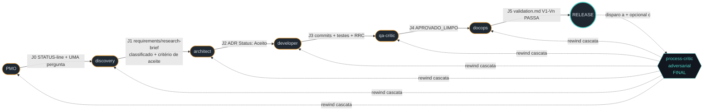

# ADR 011 — Arquitetura de QA bicelular: junções binárias forward-only + process-critic adversarial com rewind

- **Status:** Aceito (2026-05-29) — qa-critic rounds 1-4 (REPROVADO × 3 → APROVADO_LIMPO) endereçados em commits `ff73d75` (round 1: 2 MEDIO + 1 BAIXO + 2 ADV — V1-V8 + cascata-oximoro + PROMPT-CHAT-WEB) + `9e08af6` (round 2: 1 MEDIO + 2 BAIXO — §151 oximoro residual + wording drift + 8→11 edições) + `00af0c7` (round 3: 2 MEDIO — §50 6→11 edits + CHANGELOG 9→11 arquivos). Round 4: zero findings ALTO/MEDIO.
- **Data:** 2026-05-29 · **Decisores:** Fabricio (mantenedor) + Claude (papel `architect`)
- **Substitui:** nenhum · **Substituído por:** nenhum
- **Relaciona-se a:** ADR-007 (régua §0), ADR-009 (método sênior), ADR-010 (framework agnóstico + RRC + correção honesta princípio 11)
- **Fonte:** dono propôs em 2026-05-28 (sessão v1.11.0) durante crítica ao modelo de QA implícito do framework. Conversa registrada em `history.md ## Em aberto` como ADR-011 candidato. Discovery realizado inline em 2026-05-29 (lote temático Q1-Q5 + Antecipações + Backlog + Gaps não-bloqueantes — ADR-010 §i).

## Contexto

O framework opera com **N papéis sequenciais** (PMO → discovery → architect → developer → qa-critic → docops → release) e **handoffs** entre eles. A v1.11.0 demonstrou que o modelo de QA é **eficaz mas tácito**: qa-critic adversarial roda no final, 4 rounds podem ser necessários, e o autor itera. **O que NÃO está formalizado:**

1. **Quais são as junções entre papéis?** Implícitas via `/handoff` workflow genérico, sem critério binário.
2. **Cada junção tem gate?** Algumas (J4 qa-critic→docops com `APROVADO_LIMPO`, J5 docops→release com `validation.md V1-Vn PASSA`) são binárias por convenção. Outras (J0 PMO→discovery, J1 discovery→architect, J3 developer→qa-critic) são informais.
3. **Forward-only após PASS?** Tácito. Nada impede oscilação entre junções não-finais.
4. **Quem pode rewind?** Tácito. Na prática só o qa-critic final dispara (REPROVADO → autor corrige), mas não há declaração formal de que outras junções NÃO podem.
5. **Risco de loop eterno** se rewind for liberado em qualquer junção (apontado pelo dono em 2026-05-29).

Diretrizes do dono nesta sessão (2026-05-29):
- **(Q1)** Process-critic = qa-critic adversarial atual (formalização, não papel novo). **TODO QA é adversarial** (hipótese default = bug).
- **(Q2)** Junções devem ser **binárias** — retesta até aprovar dentro da junção; entre junções é forward-only. **Sem forward-only → risco de loop eterno.**
- **(Q3)** Rewind do process-critic = **cascata** por default; cirúrgico fica aberto se aparecer alternativa melhor.
- **(Q4)** `validation.md` de projeto e de framework-release = **mesmo conceito**, instâncias diferentes. Convenção única.
- **(Q5)** Gates existentes (`qa-critic APROVADO_LIMPO`, `validation V1-Vn PASSA`) **80% satisfazem** o modelo; ADR-011 formaliza e fecha o gap.
- **(SUPLANTA vs EMENDA)** §Decisão/§Alternativas muda → SUPLANTA novo ADR + `Substituído por`. §Implementação/§Consequências muda → EMENDA in-place via STATUS. Within-junction rounds = EMENDA (não conta como rewind).
- **(E1)** Process-critic dispara em (a) final de cada BLOCO APROVADO (release, ADR aceito, spec fechada, feature delivered) + (b) on-demand quando dono escalar + (c) opcional em /checkpoint substantivo como backstop.
- **(E2)** J0 (PMO → discovery) gate = STATUS-line do PMO + UMA pergunta de desambiguação (se aplicável).

## Decisão (1 frase ativa)

Formalizar **arquitetura bicelular de QA** com 6 junções binárias forward-only (J0-J5) — cada uma com artefato-gate e critério binário declarados, iterações ilimitadas DENTRO da junção até PASS, forward-only ENTRE junções após PASS — somando-se ao **process-critic adversarial final** (qa-critic em modo subagente isolado) que detém poder de **rewind cascata** (Alt 1 escolhida; rewind cirúrgico = Alt 2, deferido para v1.13.0) a qualquer junção anterior; pós-rewind, junções afetadas re-passam binárias (iterações OK).

## Alternativas consideradas

| # | Alternativa | Prós | Contras |
|---|---|---|---|
| 1 | **Bicelular: 6 junções binárias forward-only + process-critic com rewind cascata (escolhida)** | Formaliza o que já existe parcialmente; fecha gap das junções informais (J0, J1, J3); previne loop eterno via forward-only entre junções; cascata é simples e cobre tudo. | Heaviness leve em /handoff (declarar gate cada vez); cascata pode re-rodar agente downstream desnecessariamente em rewind pontual. |
| 2 | Bicelular + rewind cirúrgico (re-roda só os afetados) | Mais lean — menos re-runs. | Exige detector de impacto por artefato (qual agente downstream é afetado pelo que mudou). Complexidade real. **Mantido como pendência para v1.13.0 se aparecer caso onde cascata dói.** |
| 3 | Monolítico atual (status quo) | Zero esforço. | Handoffs informais permanecem; modelo tácito vulnerável a oscilação não-detectada. Dono pediu formalização. |
| 4 | Forward-only sem rewind (process-critic não pode voltar) | Mais simples — uma vez no docops, segue para release. | Bugs profundos descobertos no final ficam órfãos. Contradiz padrão que v1.11.0 demonstrou (qa-critic adversarial reabre stages). |
| 5 | Rewind em qualquer junção | Máxima flexibilidade. | **Loop eterno garantido** — autor pode oscilar entre J2 e J3 indefinidamente. Dono explicitamente preveniu. |
| 6 | Tudo paralelo com integração no final | Velocidade. | Contradiz framework single-thread atual; integração no final esconde junctions de qualidade. |

## Justificativa

Escolha pela **Alternativa 1** por 5 razões:

- **Coerência com prática observada**: v1.10.0 + v1.11.0 demonstraram qa-critic adversarial rodando 4 rounds no final, autor iterando, e rewind ocorrendo informalmente. ADR-011 codifica o padrão sem inventar nova mecânica.
- **Coerência com convenção de ADR**: campos `Substitui:` e `Substituído por:` já existem em `docs/adr/000-template.md`. SUPLANTA usa convenção existente; sem novo template.
- **Régua §0 (ADR-007)**: edits cirúrgicos em `/handoff` + `/checkpoint` + `qa-critic SKILL` + `pmo SKILL` + AGENT-FRAMEWORK §6 (1 princípio novo) + entry-points (CLAUDE+AGENTS, README) + CHANGELOG + GUIA-EQUIPE + web/index.html + history.md. **2 novos + 11 edições cirúrgicas** (ver tabela detalhada em §Implementação). Sem novo workflow; sem nova skill; sem novo papel.
- **Prevenção de loop eterno**: forward-only entre junções é o circuit-breaker que o dono apontou. Sem essa cláusula, oscilação entre junções não-finais é possível.
- **Cascata por default**: Alternativa 2 (cirúrgico) é mais lean mas exige detector de impacto cross-artefato — complexidade que não pagamos hoje. **Cascata cobre 100% dos casos com simplicidade**; cirúrgico fica como pendência ativável se aparecer caso real.

## Princípio novo introduzido

### Princípio 13 (`AGENT-FRAMEWORK.md §6`) — Arquitetura bicelular de QA

> **QA é arquitetura bicelular: junções binárias forward-only + process-critic adversarial com rewind cascata.** O fluxo do squad (PMO → discovery → architect → developer → qa-critic → docops → release) tem 6 junções (J0-J5); cada uma com **artefato-gate + critério binário declarados** (ver `/handoff` workflow). **DENTRO da junção:** iterações ilimitadas até PASS binário (emendas no mesmo artefato, padrão STATUS-field). **ENTRE junções:** forward-only após PASS (circuit-breaker contra loop eterno). **Process-critic adversarial** (qa-critic em subagente isolado) roda ao final de cada BLOCO APROVADO (release, ADR aceito, spec fechada, feature delivered) + on-demand + opcional em /checkpoint substantivo; detém poder de **rewind cascata** (Alt 1 escolhida; rewind cirúrgico = Alt 2, deferido para v1.13.0) para qualquer junção anterior. **TODO QA é adversarial** (hipótese default = bug). **Política SUPLANTA × EMENDA**: rewind afeta §Decisão/§Alternativas → SUPLANTA novo ADR + `Substituído por:`; afeta §Implementação/§Consequências → EMENDA in-place via STATUS-field. Within-junction rounds = EMENDA (não conta como rewind). Detalhe: **ADR-011**.

## Topologia das 6 junções (declaração obrigatória — §gate binário)

### Diagrama do fluxo (Mermaid)

**Legenda:** Setas sólidas = forward-only entre junções (PASS binário obrigatório). Setas tracejadas a partir do `process-critic` = rewind cascata para qualquer J_i; pós-rewind, J_i até J_5 re-passam binárias (iterações OK). Disparo do process-critic: **(a)** final de cada BLOCO APROVADO (mandatório), **(b)** on-demand do dono, **(c)** opcional em `/checkpoint` substantivo.

### Tabela operacional

| # | Junção | Artefato-gate | Critério binário | Quem aplica |
|---|---|---|---|---|
| **J0** | PMO → discovery | STATUS-line do PMO + (opcional) UMA pergunta de desambiguação | "natureza do trabalho nomeada + dimensão escolhida + ambiguidade resolvida (Sim/Não)" | PMO com mentalidade adversarial |
| **J1** | discovery → architect | `requirements.md` (universal) OU `research-brief.md` (cascata) | TODOS requisitos classificados (`CONFIRMADO|INFERIDO|DESCONHECIDO`) + critério de aceite binário presente + (se reforço sênior ativo, ADR-009) §7 Antecipações + §8 Backlog + §7.1 Gaps não-bloqueantes preenchidas (ADR-010 §i) | PMO adversarial (revisão estrutural) |
| **J2** | architect → developer | ADR com `Status: Aceito` (não `Proposto`) | STATUS field = "Aceito" + ponteiro (branch+data+grep) + alternativas avaliadas + consequências documentadas | PMO adversarial (revisão de completude) |
| **J3** | developer → qa-critic | commits + diff + (se aplicável) testes verdes | implementação cobre TODOS REQ do `requirements.md` + sem regressão + RRC self-applied (ADR-010 §ii) | PMO adversarial (checklist binário) |
| **J4** | qa-critic → docops | resultado adversarial do qa-critic subagente | `APROVADO_LIMPO` (não `APROVADO_COM_RESSALVAS` nem `REPROVADO`) — ressalvas devem ser endereçadas in-place via EMENDA até virar LIMPO | qa-critic adversarial (subagente isolado, modelo diferente) |
| **J5** | docops → release | `validation.md` do release (V1-Vn) | TODOS critérios = PASSA | PMO + dono (revisão humana final binária) |
| **PC** | **process-critic (final adversarial)** | revisão do bloco completo | LIMPO → autoriza merge/tag; ELSE → rewind cascata para J_i + iterações até re-PASS de J_i a J_5 | qa-critic adversarial (subagente isolado, mesma instância expandida em escopo) |

**TODO QA é adversarial** — PMO aplica gate de J0-J3 com mentalidade adversarial (assume bug, força evidência); qa-critic em subagente isolado aplica em J4 e PC com profundidade adversarial. Mesmo papel `qa-critic` em duas modalidades; intermediate gates podem usar PMO com checklist adversarial como "junction-critic lightweight" para preservar custo.

## Mecanismo operacional

### Dentro da junção (binário + iterações OK)

1. Agente do papel A produz artefato → valida contra critério binário → se FAIL, itera (emenda in-place via STATUS-field, mesmo artefato evolui).
2. Quando A julga PASS → invoca `/handoff B`.
3. Junction-critic (PMO adversarial em J0-J3, qa-critic em J4) **adversarialmente** verifica gate.
4. Se gate **FAIL** → bounce de volta para A (mesma junção, nova iteração).
5. Se gate **PASS** → forward-only para próxima junção. A junção atual **não pode mais voltar no fluxo normal** (sem ação do process-critic).

### Process-critic (final adversarial com rewind)

1. Disparo: (a) final de bloco aprovado (mandatório), (b) on-demand do dono, (c) opcional em /checkpoint substantivo (backstop).
2. Revisa artefatos do bloco inteiro adversarialmente.
3. Veredito: `APROVADO_LIMPO` → merge/tag; `REPROVADO_REWIND J_i` → rewind cascata a J_i.
4. Rewind cascata: todos os agentes downstream de J_i re-rodam (J_i → J_5). Cirúrgico fica como **pendência v1.13.0** (Alternativa 2) se cascata se mostrar custosa em caso real.
5. Pós-rewind: junções afetadas re-passam binárias (DENTRO da junção, iterações OK; ENTRE junções, forward-only restaura).

### SUPLANTA × EMENDA (decisão binária no rewind)

Quando process-critic dispara rewind, autor avalia o tipo de correção:

| Mudança afeta | Política | Justificativa |
|---|---|---|
| §Decisão | SUPLANTA — novo ADR + antigo ganha `Substituído por:` | Decisão diferente é ADR diferente; lineage exige |
| §Alternativas | SUPLANTA | Idem |
| §Implementação | EMENDA in-place via STATUS | Mesma decisão; implementação refinada |
| §Consequências | EMENDA in-place | Aprendizado, não decisão nova |
| Stale counts / typos / refs cruzadas | EMENDA in-place | Cosmético; não justifica novo ADR |
| Within-junction rounds (qa-critic 1-4 numa mesma junção) | EMENDA — padrão v1.11.0 funcionou | Process-critic adversarial DENTRO da junção; rewind global ainda não disparou |

## Implementação

### Arquivos editados/criados na v1.12.0

Escopo: **2 novos + 11 edições cirúrgicas (majoritariamente formalização do tácito)** — Alternativa 1 com régua §0 honrada por critério (c) (decisão arquitetural inalcançável editando ADR existente):

| Arquivo | Mudança | Tipo |
|---|---|---|
| `docs/adr/011-qa-bicelular-juncoes-binarias-process-critic-rewind.md` | **NOVO** (este arquivo) | Adição — critério (c) |
| `docs/specs/v1.12.0-qa-bicelular/validation.md` | **NOVO** — gate binário V1-V8 do release | Adição — critério (c) gate per release |
| `.agent/workflows/handoff.md` | **+seção "Junções binárias (J0-J5) e seus gates"** com tabela operacional + invariante forward-only | Adição cirúrgica (formaliza tácito) |
| `.agent/workflows/checkpoint.md` | **+1 linha** esclarecendo: `/checkpoint` é save-point + gate RRC (não invoca process-critic adversarial automaticamente; backstop opcional sob demanda do dono) | Edit cirúrgico (esclarecimento) |
| `.agent/skills/qa-critic/SKILL.md` | **+seção "Duas modalidades: junction-critic intermediate (J4) e process-critic final (PC com rewind)"** | Edit cirúrgico (clarifica papel) |
| `.agent/skills/pmo/SKILL.md` | **+1 linha** "PMO aplica junction-check adversarial em J0-J3 com checklist binário (ADR-011)" | Edit cirúrgico (1 linha) |
| `AGENT-FRAMEWORK.md` §6 | **+1 linha** (princípio 13: arquitetura bicelular de QA) | Adição mínima |
| `CHANGELOG.md` | **+1 bloco** [1.12.0] | Convenção |
| `CLAUDE.md` + `AGENTS.md` | **+1 seção** v1.12.0 | Convenção |
| `README.md` | bump 1.11.0 → 1.12.0 + 1 linha princípio 13 | Convenção |
| `guia/GUIA-EQUIPE.md` | **+1 linha** "Junções binárias forward-only (ADR-011)" | Edit cirúrgico |
| `guia/web/index.html` | bump versão + 1 card "QA bicelular" | Convenção |
| `history.md` | close v1.11.0 + open v1.12.0 + close ADR-011 candidato | Convenção |

**Total efetivo:** 2 novos + 11 edits (1-3 linhas cada; mais 1 seção em handoff.md ~20 linhas; mais princípio 13 ~1 linha). Sem nova pasta, workflow, skill, ou papel.

## Consequências

### Positivas

1. **Formaliza padrão tácito** — junções existentes ganham gates binários declarados; vulnerabilidade de oscilação resolvida.
2. **Previne loop eterno** — forward-only entre junções é circuit-breaker explícito.
3. **TODO QA é adversarial** — mentalidade unificada em todo o pipeline; PMO ganha checklist adversarial.
4. **Process-critic com rewind formal** — qa-critic adversarial final tem poder explícito de mandar de volta; sem essa formalização, qa-critic podia "REPROVAR" mas a etapa correta de retorno ficava informal.
5. **SUPLANTA × EMENDA** — política binária para decisão "novo ADR ou emenda in-place"; resolve ambiguidade prática observada em v1.10.0/v1.11.0.
6. **Régua §0 honrada** — formalização ≥ adição pura; gates explícitos > tácitos sem custo de novas skills/workflows.
7. **Cascata simples** — não exige detector de impacto cross-artefato; alternativa cirúrgica fica como pendência ativável.

### Negativas

1. **Heaviness leve em /handoff** — autor precisa declarar PASS do gate ANTES de invocar `/handoff`. Mitigado: gate é binário e curto; checklist em /handoff já é convenção.
2. **Cascata pode re-rodar downstream desnecessariamente** — se rewind a J1 muda só §Implementação de J1, J2-J5 re-rodam mesmo que não-afetados. Mitigado: pendência v1.13.0 para cirúrgico se aparecer caso real (Alternativa 2).
3. **PMO ganha responsabilidade adversarial em J0-J3** — pode aumentar atrito intermediário. Mitigado: PMO já é orquestrador; checklist binário não muda essência, só formaliza mentalidade.

### Riscos

1. **Within-junction rounds podem inflar STATUS-field** — qa-critic 4 rounds (v1.11.0) levou Status a `"Aceito após rounds 1-4 com 16 findings"`. Não-bloqueante; documentação evolutiva. Mitigação: convenção limita STATUS a ~3 linhas; detalhe vai para CHANGELOG/history.
2. **SUPLANTA × EMENDA pode ter casos cinzentos** — mudança que TOCA §Alternativas marginalmente sem mudar decisão final: emenda ou suplanta? Política sugerida: **SE a leitura externa da §Decisão muda em substância → SUPLANTA; SE só o caminho/contexto muda → EMENDA**.
3. **Rewind cirúrgico (Alt 2) deferido pode ser problema** — caso real onde cascata custosa apareça antes que pendência seja tratada (Alt 2 deferida para v1.13.0). Aceito: trade-off documentado; ativar via ADR-012 emergencial se ocorrer.

## Pendências e follow-ups (fora desta v1.12.0)

- **Alternativa 2 (rewind cirúrgico)** — implementar se aparecer caso real onde cascata é custosa. Detector de impacto cross-artefato exige design dedicado. v1.13.0 candidato.
- **Junction-critic vs process-critic — separação operacional** — se carga adversarial em J4 (qa-critic intermediate) ficar pesada na prática, considerar reservar qa-critic só para process-critic (PC) e mover J4 para "release-gate" puro. Avaliar com casos reais.
- **Validation.md de projeto × validation.md de release** — Q4 confirmou "mesmo conceito, instâncias diferentes". Templates podem convergir (`docs/specs/_template/validation.md` cobre projeto; cada release ganha seu próprio em `docs/specs/<release>/validation.md`). Sem inflação por enquanto.

## Referências

- ADR-007 (régua §0 + workflow firewall).
- ADR-009 (método sênior + observação meta-cognitiva — princípio 11 reescrito em v1.11.0).
- ADR-010 (framework agnóstico + RRC + correção honesta princípio 11 + sub-princípios anexos i/ii/ii-a/ii-b).
- Workflows tocados: `.agent/workflows/handoff.md` (seção nova), `.agent/workflows/checkpoint.md` (1 linha).
- Skills tocadas: `.agent/skills/qa-critic/SKILL.md` (seção nova), `.agent/skills/pmo/SKILL.md` (1 linha).
- Discovery inline desta sessão (2026-05-29): Q1-Q5 + Antecipações + Backlog + Gaps não-bloqueantes em conversação registrada.
